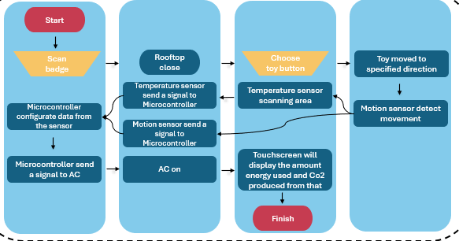

# 🌡️ ESP8266 + SHT31 + DHT11 + PIR + Kipas (2N222 + Dioda)  
**Smart Fan Control System — Temperature & Motion Based Automation**

Proyek ini mengimplementasikan sistem otomatisasi kipas berdasarkan suhu ruangan dan deteksi gerakan, mengikuti alur logika dari flowchart berikut:

**Scan badge → Konfigurasi sensor → Cek suhu → Deteksi gerakan → Kipas ON → Hitung energi & CO₂**

Flowchart referensi:  

---

## 🧩 Perangkat Keras yang Digunakan

| Komponen | Fungsi |
|-----------|---------|
| **ESP8266 (NodeMCU 1.0)** | Mikrokontroler utama |
| **SHT31** | Sensor suhu & kelembapan (utama, I²C) |
| **DHT11** | Sensor cadangan (jika SHT31 gagal terbaca) |
| **PIR Sensor** | Deteksi gerakan manusia |
| **Kipas DC 5V** | Output aktuator |
| **Transistor 2N222** | Driver untuk kipas (low-side switch) |
| **Dioda (1N4007 / 1N4148)** | Flyback protection |
| **Resistor basis 1k–4.7kΩ** | Pembatas arus ke basis transistor |
| **Baterai / Adaptor 5V** | Sumber daya utama kipas |

---

## ⚙️ Wiring Diagram

| Komponen | ESP8266 Pin | Keterangan |
|-----------|--------------|------------|
| **SHT31** | SDA → D2 (GPIO4), SCL → D1 (GPIO5), VCC → 3V3, GND → GND | Komunikasi I²C |
| **DHT11** | DATA → D4 (GPIO2), VCC → 3V3, GND → GND | Cadangan pembacaan suhu |
| **PIR Sensor** | OUT → D5 (GPIO14), VCC → 5V/3V3, GND → GND | Deteksi gerakan |
| **Kipas DC** | +5V → Kipas(+), Kipas(−) → Kolektor 2N222 | Dikontrol via transistor |
| **Transistor 2N222** | Basis → D6 (GPIO12) via resistor 1k–4.7k, Emitor → GND | Driver kipas |
| **Dioda Flyback** | Katoda → +5V, Anoda → Kolektor kipas | Lindungi dari induksi balik |

⚠️ **Semua GND harus terhubung bersama (common ground).**

---

## 💻 Software Setup

1. **Board:**  
   - Pilih **NodeMCU 1.0 (ESP-12E Module)** pada *Tools → Board*  
   - Pastikan baudrate: **115200**

2. **Library yang diperlukan:**  
   - `Adafruit SHT31 Library`  
   - `DHT sensor library (by Adafruit)`

3. **Install melalui Library Manager** (`Sketch → Include Library → Manage Libraries...`)

---

## 🚀 Langkah Penggunaan

### 1️⃣ Upload Program
- Salin file `src/main.ino` (kode utama).
- Upload ke board menggunakan Arduino IDE.

### 2️⃣ Simulasi “Scan Badge”
- Buka **Serial Monitor (115200 baud, Newline)**  
- Ketik **`SCAN`** dan tekan **Enter**  
  → Sistem aktif, sensor mulai dikonfigurasi.

### 3️⃣ Pengujian Logika
| Kondisi | Aksi Sistem |
|----------|-------------|
| Suhu ≥ **28°C** dan PIR mendeteksi gerakan | Kipas **MENYALA** |
| Suhu ≤ **26°C** atau PIR tidak mendeteksi gerakan | Kipas **MATI** |
| SHT31 gagal baca data | Program otomatis pakai **DHT11** |

### 4️⃣ Monitor Hasil di Serial
Contoh output:
[T]=29.3C [H]=63% PIR=MOTION FAN=ON E=0.000007 kWh CO2=0.000006 kg
**Keterangan kolom:**
- `T` → Suhu (°C)
- `H` → Kelembapan (%)
- `PIR` → Status gerakan (MOTION / NO)
- `FAN` → Status kipas
- `E` → Energi terakumulasi (kWh)
- `CO2` → Estimasi emisi CO₂ (kg)

---

## ⚙️ Parameter yang Bisa Disesuaikan

| Parameter | Fungsi | Default |
|------------|---------|----------|
| `TEMP_ON_C` | Suhu kipas menyala | 28°C |
| `TEMP_OFF_C` | Suhu kipas mati | 26°C |
| `FAN_POWER_W` | Daya kipas (Watt) | 2.5 W |
| `CO2_FACTOR` | Faktor emisi CO₂ (kg/kWh) | 0.82 |
| `READ_INTERVAL_MS` | Interval pembacaan sensor | 1000 ms |

---

## 🔍 Troubleshooting

| Masalah | Penyebab | Solusi |
|----------|-----------|---------|
| `[SHT31] tidak terdeteksi` | Salah pin SDA/SCL / tegangan salah | Gunakan D2 (SDA), D1 (SCL), dan suplai 3V3 |
| Suhu `NaN` | SHT31 & DHT11 gagal terbaca | Cek kabel, suplai daya, atau ganti sensor |
| PIR tidak berubah status | Warm-up 30–60 detik / suplai kurang | Tunggu beberapa detik, pastikan VCC sesuai modul |
| Kipas tidak menyala | GND tidak common / basis tanpa resistor | Satukan GND baterai & ESP, beri resistor basis 1k–4.7k |
| ESP reset saat kipas ON | Lonjakan arus / EMI | Tambah kapasitor 100–470 µF dekat kipas & pastikan dioda terpasang |

---

## 🧠 Prinsip Kerja Singkat

1. Setelah “scan badge”, ESP8266 mengonfigurasi sensor SHT31 & DHT11.  
2. Setiap detik, ESP membaca suhu dan kelembapan.  
3. Jika PIR mendeteksi gerakan dan suhu melebihi ambang, kipas menyala.  
4. Saat kipas aktif, sistem menghitung energi yang digunakan (`E = P × t`) dan estimasi CO₂ (`CO₂ = E × faktor`).  
5. Data ditampilkan di Serial Monitor — menggantikan fungsi touchscreen pada flowchart.
